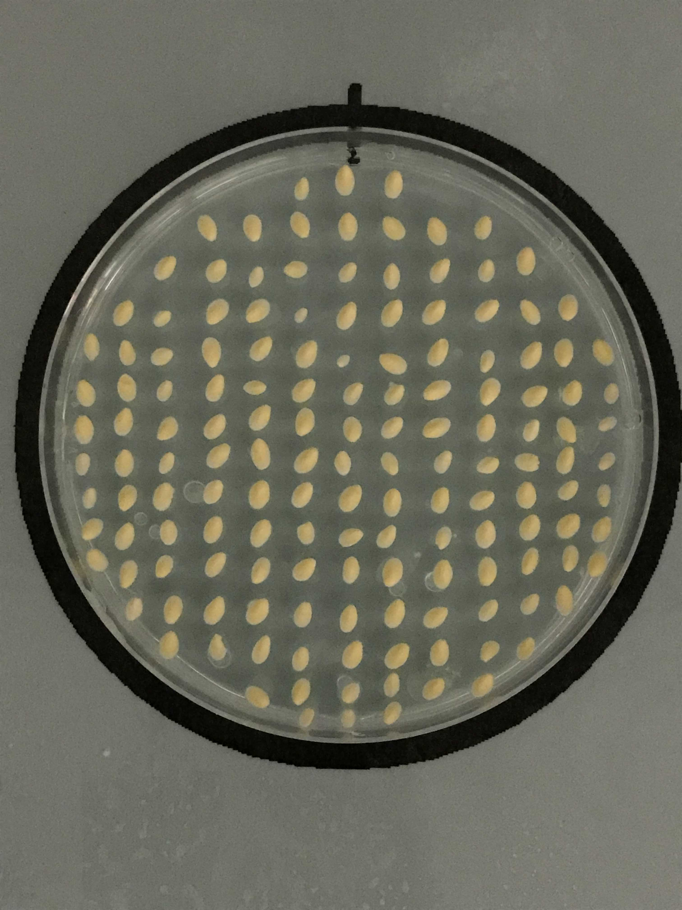
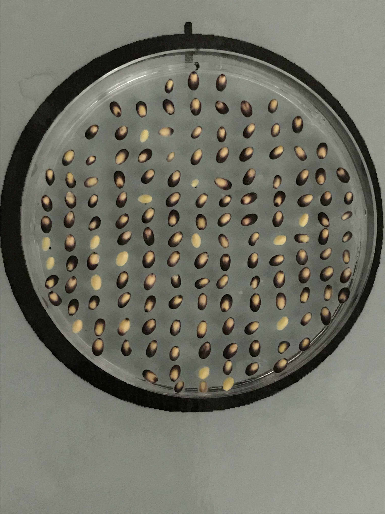
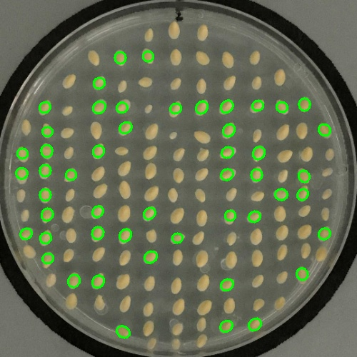

# Purple-Kernel-Eater-Monster-Ideation

This is task to detect the yellow seeds that will turn into black monster seeds. 
For more information visit this [documentations](https://docs.google.com/document/d/1yBV0RvcwPRbndyUkPGfNURUmp_K-Yu6IROupFEKtFfo/edit#heading=h.cpkwrdb91x0)

## Prerequisites

- Python 3.6.8
- [OpenCV 4.0.0](https://opencv.org/)
- [Scikit-learn](https://scikit-learn.org/stable/install.html)
- Download the [dataset](https://drive.google.com/open?id=1G1IRNQq12duHkinq3zPoClWFLS4Vdirf). Store it in project directory folder under `images` folder.

## Goal

You can see the sample pair of image below. Goal is to achive the best accuracy for the prediction of which seeds will turn to black.

| Day One | Day Two | Predicted Image |
| :----------------: | :-------------------------: | :-------------------------: |
| </img> | </img> | </img> | 

## How to run the code

To train images and train model run following code

`python train.py` or

`python train.py --datasetPath 'PATH_OF_DATASET' --outputPath 'PATH_OF_OUTPUT_DIR'`

In above code both `datasetPath` and `outputPath` are optional.

To test and create model with predicted result file run following command

`python test.py` or

`python test.py --datasetPath 'PATH_OF_DATASET' --outputPath 'PATH_OF_OUTPUT_DIR'`

## Insights

#### Training data
- First `indexed_images.csv` will be generated, it seperated the both 24 hours before and after images by it's name. 
- Training file will crop the circles in `cropped` folder, both images folder `before` and `after` will be created inside `cropped` folder.
- Then the seeds are seperated from above folders. In root directory of project two folders will created named as `before` and `after`
- Store the `seeds_converted.csv` inside folder `saved_csv` where the seeds that are converted into purple monster will be saved. 
- Now the size and position will be captured in `final_data.csv`. If the seeds conveted or not that detail will be stored in `maindf.csv`
- It's time to train model. Model will be created based on the images.

#### Testing data
- File will be cropped and will find the seeds details.
- Seeds details will act as an input for saved model
- If the seed detected as monster it will draw ellipse around it.
